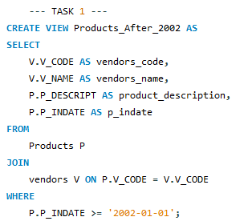
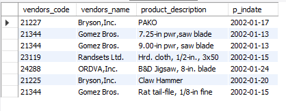
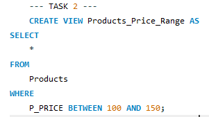
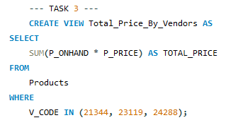
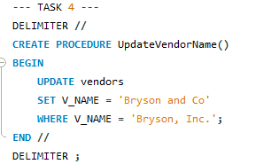
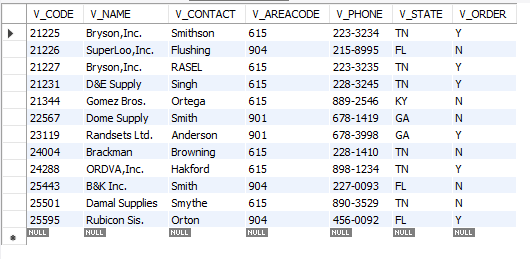
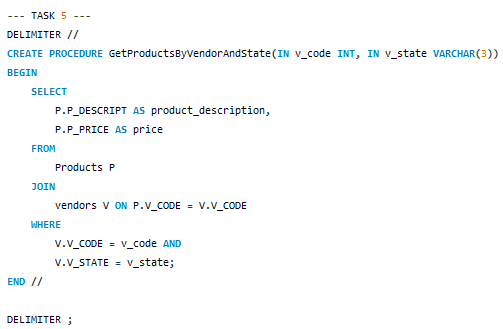

 # Finals Task 5.
## Using SQL views and Stored Procedures and Stored Functions
## Instructions: 

1. To have an idea of how SQL views work, kindly read the lecture on SQL views and stored procedures, then you may try the following examples in MySQL Workbench: 

2. Start Xampp and MySQL Workbench – create or start a connection 

4. Open the democodes.sql, and you may try executing all the examples using the hrd.sql file

5. AFTER the practice codes…. Perform the required SQL statements of the ff: use inventory.sql for this.

6. Print screen the appropriate sql and output per item

1.	CREATE A VIEW that will display the vendors_code, vendors name, product description p_indate, of all products with p_indate from 2002 onwards

2.	CREATE a VIEW that will display all products whose price range is between 100-150

3.	Create a VIEW that will COMPUTE for the (TOTAL_PRICE) of ALL PRODUCTS by getting the (P_ONHAND x P_PRICE) Sold by vendors with the following v_code (21344, 23119 and 24288)

4.	CREATE a STORED PROCEDURE that WILL take a SINGLE PARAMETER and UPDATED the Name of Vendor ‘Bryson,Inc.’ to ‘Bryson and Co’.

5.	CREATE A Function that will take 2 parameters(v_code and v_state) and display All the product description and price based on the parameters passed to the function

## Query Statements & Table Structure:
### Task 1:
#### Query:

#### Table:

### Task 2:
#### Query:

#### Table:

### Task 3:
#### Query:

#### Table:

### Task 4:
#### Query:

#### Table:

### Task 5:
#### Query:

#### Table:

