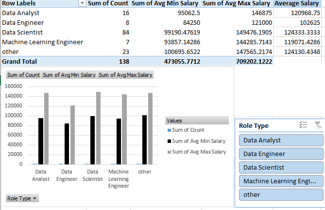
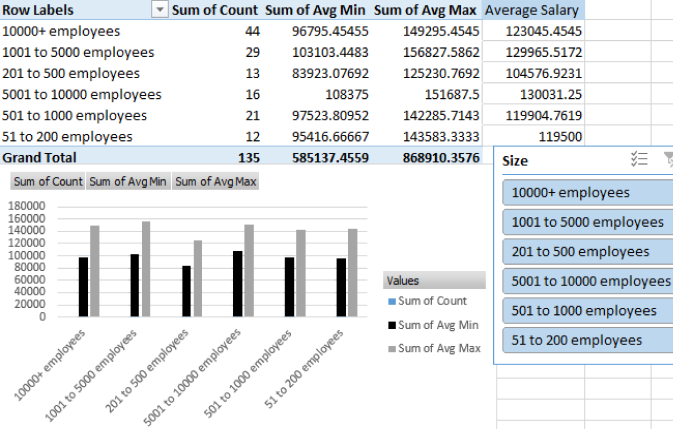
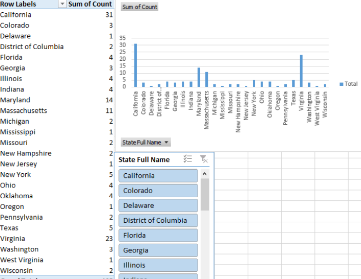

# Midterm Task 3 - Creating Pivot Table and Dashboard
For this task I created an interactive Data Science Salary & Job Trends Dashboard using Excel.

## Step By Step Process:
### Open the Worksheet on Uncleaned DS Jobs and the Transform Tables:
- Sal By Role
- Sal By State
- Sal By Size
### Design the dashboard to highlight the following:
- State with the most Data Science jobs
- Job role with the highest average salary
- Company size that pays the highest salary
### Create a pivot table:
- Use pivot tables to summarize data for sector jobs and salary (d & e)
- Generate charts for reports
- Use bar, column, or pie charts to visualize salary trends and job distribution
- Insert slicers for filtering
- Add slicers for role type, company size, and state to make the dashboard interactive
### Apply design & formatting
- Customize the colors, fonts, and layout to make the dashboard visually appealing
### Complete the dashboard
- Ensure all required visuals and reports are included
- The slicers should be functional and interactive

## Here's the Screenshot of My Output:
### Sal by Role Type:

### Sal by Size:

### Sal by State:

### Dashboard: 

